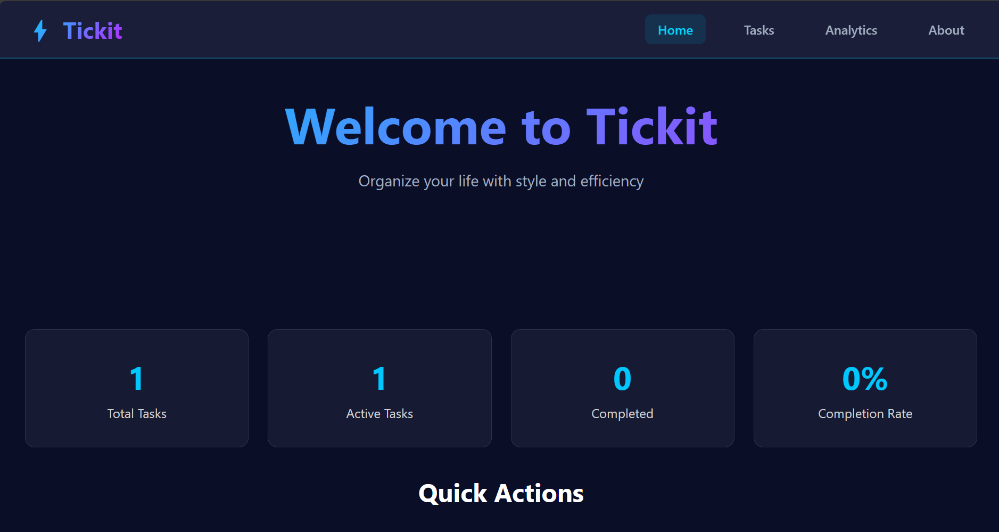
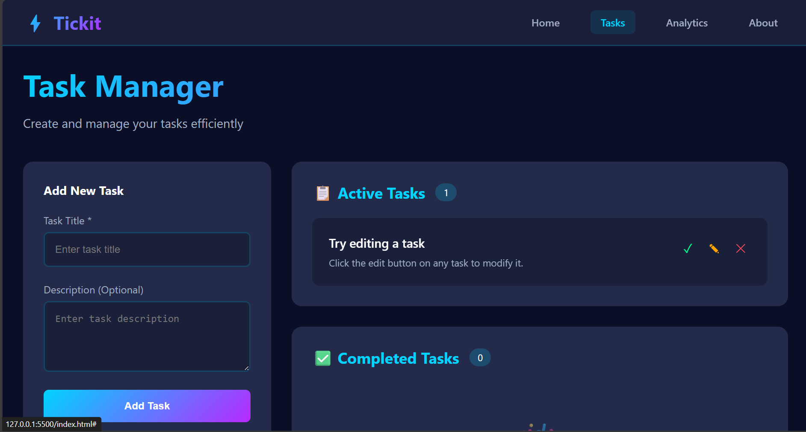
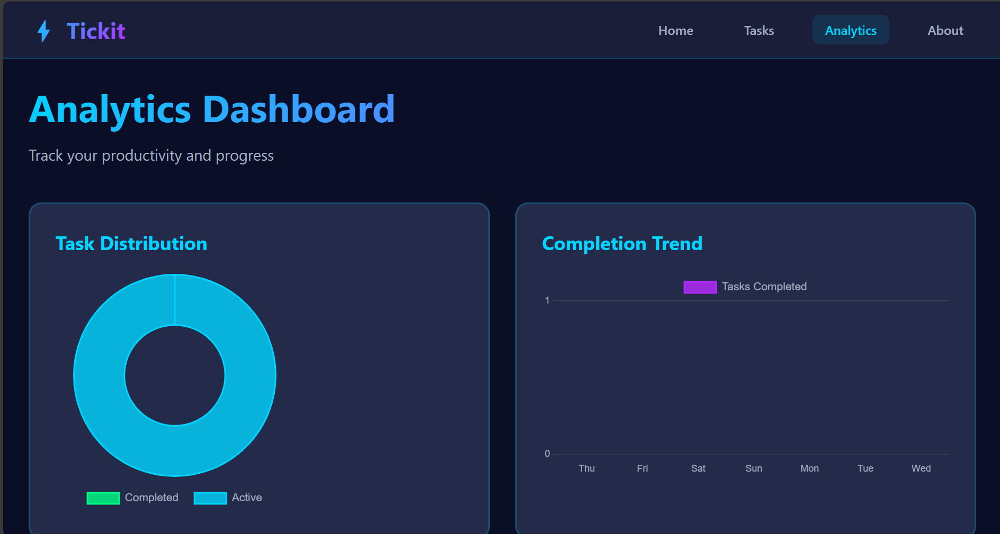
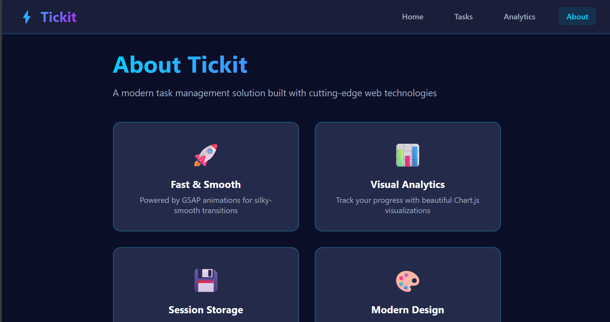

# ⚡ Tickit: A Modern Task Management Flow

Tickit is a sleek, animated, and feature-rich task management single-page application (SPA). Built entirely on the frontend, it offers a fast, fluid user experience with visual analytics to track productivity.

## ✨ Features

* **Dark, Neon Aesthetic:** A modern UI with a dark background and bright, accent colors.
* **Fluid Animations:** Utilizes **GSAP** (GreenSock Animation Platform) for smooth, engaging section transitions and task interactions (add, complete, delete).
* **Visual Analytics:** Integrated with **Chart.js** to provide a dashboard with a task distribution donut chart and a completion trend bar chart.
* **Full CRUD:** Complete functionality to **C**reate, **R**ead, **U**pdate, and **D**elete tasks.
* **Task Categorization:** Tasks are automatically split into **Active** and **Completed** lists.
* **Progress Tracking:** An overall progress bar tracks your completion rate on the tasks page.
* **Responsive Design:** Optimized to look great on desktop, tablet, and mobile devices.
* **No Backend Required:** All data management is handled client-side in JavaScript (persists for the duration of the session).

## 🚀 Technologies Used

* **HTML5**
* **CSS3** (with CSS Variables for easy theming)
* **JavaScript (ES6+)**
* **GSAP:** For high-performance, complex animations.
* **Chart.js:** For generating interactive data visualizations.

## 🛠️ Installation and Setup

Since Tickit is a pure frontend application, no complex build or server setup is required.

1.  **Clone the Repository:**
    ```bash
    git clone [your-repo-url]
    cd tickit
    ```

2.  **Open the File:**
    Simply open the `index.html` file in your web browser.

    > **Note:** For a production environment or if you encounter issues with third-party libraries (like Chart.js), you might need to serve the files via a simple local HTTP server (like VS Code's Live Server extension).

## 💡 Usage

### Navigation
The application uses a fixed navigation bar to switch between the four main sections:
* **Home:** Overview of your stats and recent activity.
* **Tasks:** The core task management interface (add, edit, delete, complete).
* **Analytics:** Visual dashboards showing task distribution and progress trend.
* **About:** Information about the application and its features.

### Task Management
1.  **Add a Task:** Navigate to the **Tasks** section, fill in the **Task Title** (required) and an optional **Description**, then click **"Add Task"**.
2.  **Complete a Task:** Click the **check mark (✓)** button next to an active task. It will animate and move to the **Completed Tasks** list.
3.  **Edit a Task:** Click the **pencil (✎)** button next to an active task. The form will pre-fill, and the button will change to **"Update Task"**.
4.  **Delete a Task:** Click the **cross (✕)** button next to any task (active or completed).

## 📂 Project Structure

| File | Description |
| :--- | :--- |
| `index.html` | The main structure of the application, including section layouts and CDN links (GSAP, Chart.js). |
| `style.css` | All styling, including CSS variables, layout (Flexbox, Grid), responsive breakpoints, and base styles. |
| `script.js` | The core JavaScript logic: the `TaskManager` class, DOM manipulation, event listeners, GSAP integrations, and Chart.js initialization/updates. |

## 🖼️ Screenshots
HOME PAGE


ADD TASK 


ANALYSIS


ABOUT



## Demo
Deployment Link-https://ramya-rastogi.github.io/Tickit/


## 📄 License

This project is open-source and available under the MIT License.
